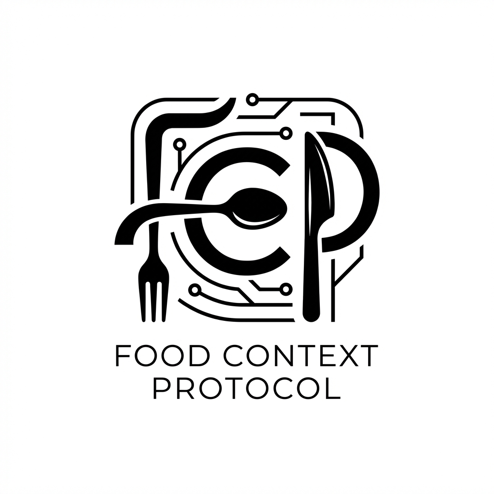

<div align="center">
  
  <h1>Food Context Protocol (FCP)</h1>
  <p><strong>Open infrastructure for food AI applications</strong></p>
</div>

FCP is a universal protocol that enables AI assistants to understand, track, and interact with food data across any application. Built on the Model Context Protocol (MCP), FCP provides a standardized way for AI models to access food intelligence.

---

## Quick Start

```bash
# Install the Python SDK
uv add fcp-python

# Or use the TypeScript SDK
npm install @fcp/sdk
```

```python
from fcp import FCPClient

client = FCPClient(
    base_url="https://fcp.dev",
    api_key="your-key"
)
result = client.analyze.analyze_meal(image_url="https://example.com/food.jpg")
print(result.nutrition)
```

---

## Repositories

### Core Protocol
- **[fcp](https://github.com/Food-Context-Protocol/fcp)** - Protocol specification, governance, and documentation

### Server & Implementation
- **[fcp-gemini-server](https://github.com/Food-Context-Protocol/fcp-gemini-server)** - Reference Gemini 3-powered Python/FastAPI implementation with 40+ MCP tools
- **[fcp-gemini-python-client](https://github.com/Food-Context-Protocol/fcp-gemini-python-client)** - Standalone Gemini 3 API client with multimodal support

### Client SDKs
- **[python-sdk](https://github.com/Food-Context-Protocol/python-sdk)** - Auto-generated Python client
- **[typescript-sdk](https://github.com/Food-Context-Protocol/typescript-sdk)** - Auto-generated TypeScript client

---

## Features

FCP provides AI-powered capabilities across 6 core domains:

- **Nutrition Intelligence** - Meal logging, nutritional analysis, dietary insights, taste profile learning
- **Inventory Management** - Smart pantry tracking, shopping lists, ingredient substitution, barcode lookup
- **Recipe Operations** - Recipe extraction from photos/videos/URLs, format conversion, flavor pairing
- **Food Safety** - FDA recall monitoring, allergen alerts, freshness predictions
- **Discovery & Planning** - Restaurant finder, meal planning, food trend analysis
- **Business & Clinical** - Meal donation coordination, dietitian reports, content publishing

---

## Powered by Gemini 3

FCP leverages **15+ Gemini 3 features**:

- **Multimodal Understanding** - Process images, audio, video, and PDFs
- **Grounding & Search** - Real-time data retrieval and fact-checking
- **Thinking Mode** - Complex reasoning for meal planning and nutrition
- **Live API** - Real-time voice interactions for hands-free cooking
- **Function Calling** - Native tool integration for seamless AI workflows
- **Context Caching** - Efficient handling of large recipe databases
- **JSON Mode** - Structured outputs for recipe and nutrition data
- **Streaming** - Real-time response generation

---

## Architecture

```
AI Assistants (Claude, Gemini, ChatGPT, Custom Apps)
                    |
                    | MCP Protocol
                    v
         FCP Server (fcp.dev)
    +-----------------------------------+
    | 40+ MCP Tools (dev.fcp.*)         |
    | nutrition, recipes, safety,       |
    | inventory, discovery, planning    |
    +-----------------------------------+
                    |
                    | Gemini 3 Connector
                    v
    +-----------------------------------+
    | Gemini 3 API                      |
    | Multimodal | Thinking | Grounding |
    +-----------------------------------+
                    |
                    v
    Storage: Firestore | Cloud Storage
    External: FDA API | Google Maps | OpenFoodFacts
```

---

## Documentation

- **[Protocol Spec](https://github.com/Food-Context-Protocol/fcp)** - Technical specification and tool reference
- **[API Docs](https://fcp.dev/docs)** - OpenAPI documentation
- **[Examples](https://github.com/Food-Context-Protocol/fcp-gemini-server/tree/main/examples)** - Code samples and workflows
- **[Contributing](https://github.com/Food-Context-Protocol/fcp/blob/main/CONTRIBUTING.md)** - How to contribute

---

## Built for Gemini 3 Hackathon

FCP was created to showcase the power of Gemini 3 API for building production-grade AI infrastructure. By combining 15+ Gemini features with the Model Context Protocol, FCP demonstrates how to build scalable, multimodal AI systems that understand food.

**Key Innovations:**
- First open protocol for food AI built on MCP
- Real-time multimodal food analysis (image + voice + text)
- Thinking mode for complex meal planning and nutrition
- Live API integration for hands-free cooking guidance
- Production-ready with 100% test coverage

---

## License

Apache-2.0 License - See [LICENSE](https://github.com/Food-Context-Protocol/fcp/blob/main/LICENSE)

---

**Website:** [fcp.dev](https://fcp.dev) | **Docs:** [fcp.dev/docs](https://fcp.dev/docs)

<div align="center">
  <sub>Built by the Food Context Protocol Contributors</sub>
</div>
